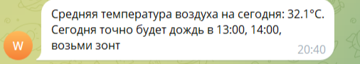

# Телеграм бот погоды

Данный бот отправляет сообщение о средней температуре и необходимости зонта, в определенное время 

Проект разработан для экономии времени на просмотр и анализ погодных условий

Пример сообщения:

Бота можно настроить под определенный регион и выбрать временные интервалы для сообщений.
